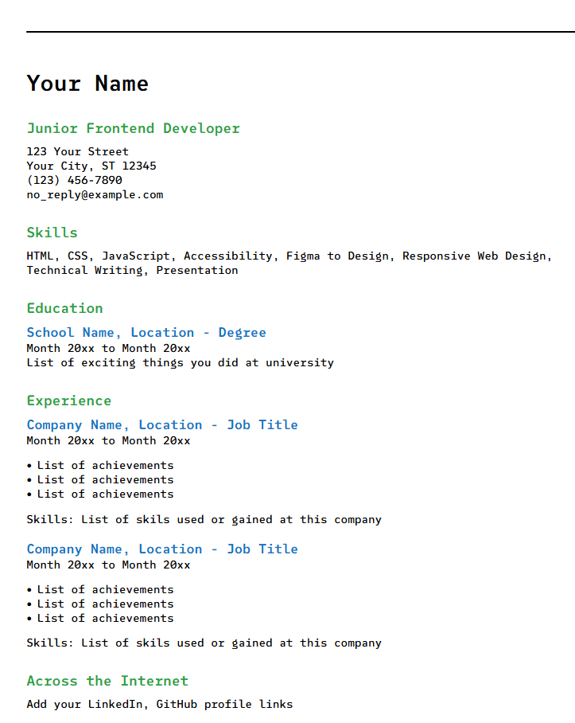

# Single-Page CV

This is a **Single-Page CV** project for [roadmap.sh.](https://roadmap.sh/projects/single-page-cv)

## Technologies Used
 - HTML5
 - CSS3
 - Google Fonts (SUSE Mono)

---

## Key Features
 - Clean, professional CV layout
 - Responsive design for all screen sizes
 - Semantic HTML structure
 - Custom typography using SUSE Mono font
 - Print-friendly styling

---

## How to Run
 1. Download the **Single-Page-CV** folder
 2. Ensure it contains:
    - `index.html`
    - `style.css`
 3. Open `index.html` in your preferred web browser

---

## Project Structure
```
Single-Page-CV/
│
├── index.html # Main HTML file
└── style.css # Stylesheet
```

---

## Design Highlights
 - Modern and minimalist design
 - Color-coded sections (green headers, blue subheaders)
 - Well-spaced typography hierarchy
 - Cross-browser compatible
 - Accessible semantic markup

---

## Customization
Simply edit the `index.html` file to update your personal information, work experience, education, and skills. The styling will automatically adapt to your content.

---

## Live Demo
[View Project](https://apacy.github.io/Single-Page-CV/)

---

## Preview



---

Built as part of the [roadmap.sh](https://roadmap.sh/) frontend project challenges
